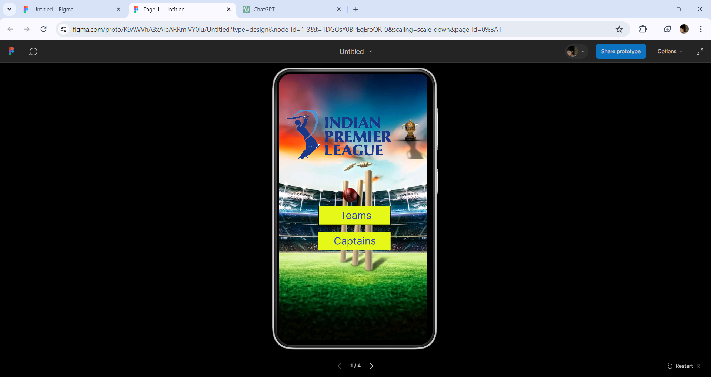
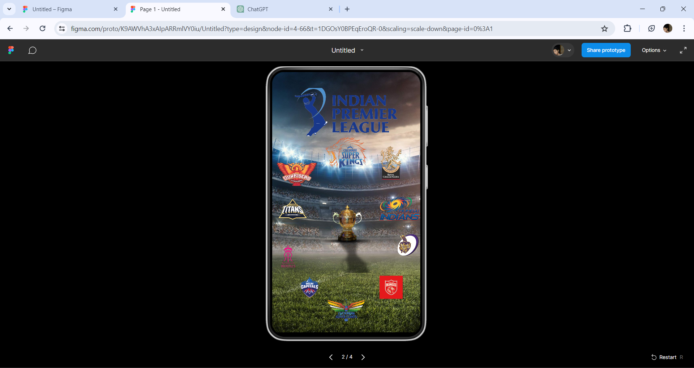
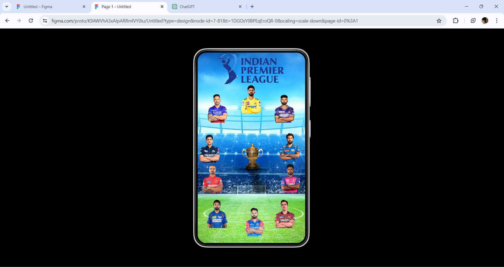
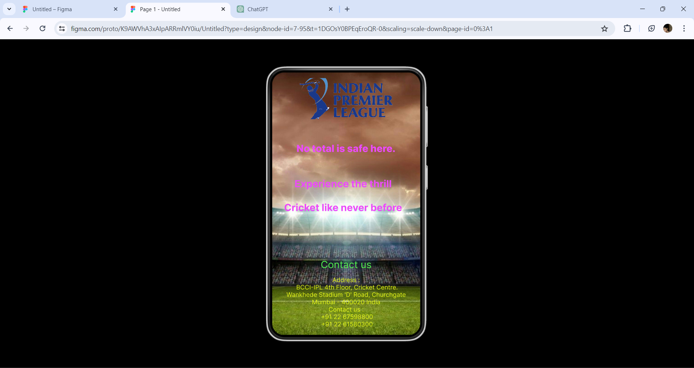

# Ex09 Event Registration Web Application
## Date:07-05-2024

## AIM:
To design, develop and deploy a web application for event registration.

## DESIGN STEPS:

### Step 1:
Create a new frame.

### Step 2:
Select any one preset size of your choice.

### Step 3:
Select the shapes you need.

### Step 4:
Import images as needed.

### Step 5:
Create pages based on your need and link them.

### Step 6:

Validate the HTML and CSS code.

### Step 6:

Publish the website in the given URL.

## DESIGN TOOL:
Figma

## CODE:
Developed by:SETHUKKARASI C<br>
Register Number:212223230201

ipl2024:
```
<!DOCTYPE html>
<html>

<head>
    <link href="https://fonts.googleapis.com/css?family=Inter&display=swap" rel="stylesheet" />
    <link href="./css/main.css" rel="stylesheet" />
    <title>Document</title>
</head>

<body>
    <div class="v1_3">
        <div class="v3_4"></div>
        <div class="v4_5"></div>
        <div class="v4_6"></div>
        <div class="v4_8"></div>
        <div class="v1_2"></div><span class="v4_11">Teams</span><span class="v4_65">Captains</span>
    </div>
</body>

</html>

```

teams:
```
<!DOCTYPE html>
<html>

<head>
    <link href="./css/main.css" rel="stylesheet" />
    <title>Document</title>
</head>

<body>
    <div class="v4_66">
        <div class="v4_67"></div>
        <div class="v4_68"></div>
        <div class="v5_78"></div>
        <div class="v5_77"></div>
        <div class="v5_69"></div>
        <div class="v5_70"></div>
        <div class="v5_71"></div>
        <div class="v5_72"></div>
        <div class="v5_73"></div>
        <div class="v5_74"></div>
        <div class="v5_75"></div>
        <div class="v5_79"></div>
        <div class="v5_80"></div>
    </div>
</body>

</html>
```

captains:
```
<!DOCTYPE html>
<html>

<head>
    <link href="./css/main.css" rel="stylesheet" />
    <title>Document</title>
</head>

<body>
    <div class="v7_81">
        <div class="v7_82"></div>
        <div class="v7_83"></div>
        <div class="v7_84"></div>
        <div class="v7_85"></div>
        <div class="v7_86"></div>
        <div class="v7_87"></div>
        <div class="v7_88"></div>
        <div class="v7_89"></div>
        <div class="v7_90"></div>
        <div class="v7_91"></div>
        <div class="v7_92"></div>
        <div class="v7_93"></div>
        <div class="v7_94"></div>
    </div>
</body>

</html>
```

contact:
```
<!DOCTYPE html>
<html>

<head>
    <link href="https://fonts.googleapis.com/css?family=Inter&display=swap" rel="stylesheet" />
    <link href="./css/main.css" rel="stylesheet" />
    <title>Document</title>
</head>

<body>
    <div class="v7_95">
        <div class="v7_96"></div>
        <div class="v7_97"></div><span class="v7_99">Contact us</span><span class="v8_101">No total is safe
            here.</span><span class="v8_102">Experience the thrill

            Cricket like never before</span><span class="v8_100">Address :
             BCCI-IPL 4th Floor, Cricket Centre. Wankhede Stadium 'D' Road, Churchgate Mumbai - 400020 India
            Contact us :
             +91 22 67598800 +91 22 61580300</span>
    </div>
</body>

</html>
```

## OUTPUT:





## RESULT:
The program to design, develop and deploy a web application for event registration is completed successfully.
